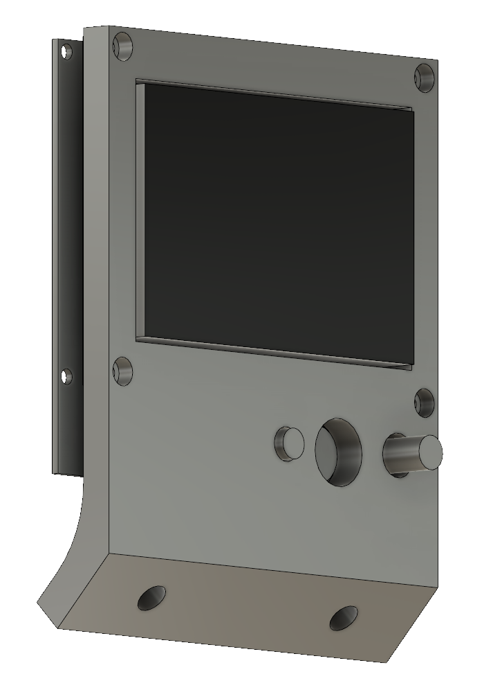

# 2020 LCD bracket

This is an angled mount bracket for the RepRapDiscount Full Graphic LCD
Controller for 2020 extrusion. It is ideal for printers which are placed on
tables below eye level (most of them).

It is designed to print with the front face facing the bed (LCD cutout facing
straight up).

## Required hardware

- 2x M5 (or smaller) bolts and T nuts
- 4x M3x25mm
- 4x M3 nuts

