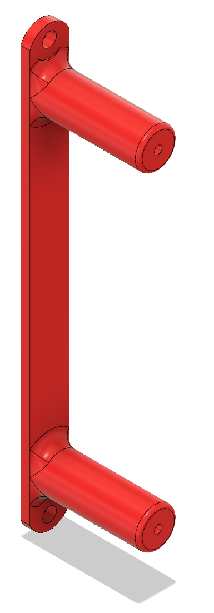

# apu2 rack mount bracket

This is a bracket to mount a [PC Engines apu2](http://pcengines.ch/apu2.htm) to a standard 19 inch server rack which has rails on the sides of the rack in addition to the front and back.

I've designed this for my particular unknown-brand aluminum extrusion based rack, and it can accomodate up to 50mm of recess of the rails. The intended use for this bracket is that it exposes the front of the apu2 next to the rack post.

Due to lighting constraints as well as privacy concerns with the location of the rack it is installed in, a picture of it in action is not provided.

It may be moderately difficult to print as it is 190mm long and as such makes an excellent test of bed leveling.

The mount is not entirely on a 1RU line, and the bottom bolt should be put in the bottom screw hole of a U, then the top goes where it fits.

Here is a picture of the bracket itself. The apu2 goes on the end of the posts which have screws come in from the back.

STL, STEP, and Fusion 360 archive formats are available in this directory.

## Materials used

- 2x M6 cage nut and M6 bolt
- 2x M3x15mm socket head cap screw (what was available at the time of design)