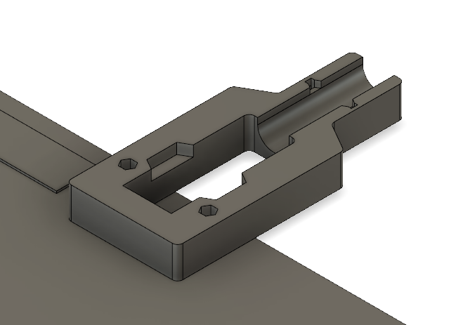

# Bed Strain Relief for the MakerFarm Pegasus

I found the lack of strain relief on the bed of the Pegasus particularly
concerning because it comes with particularly inflexible wires soldered
directly to the bed. So I designed a strain relief to mount at the back of the
bed to keep the weak section very straight.

There are no existing holes to put this in in a convenient place, so the drill
template PDF should be used to make the appropriate holes with a 1/8 in drill
bit. The PDF here is in US letter (8.5x11 inch), if an A4 one is required,
please file an issue.

## Required hardware

- 2x M3x15mm
- 2x M3 nut
- 1x small zip tie (mine has a cross section of 2.5mm x 1mm)

