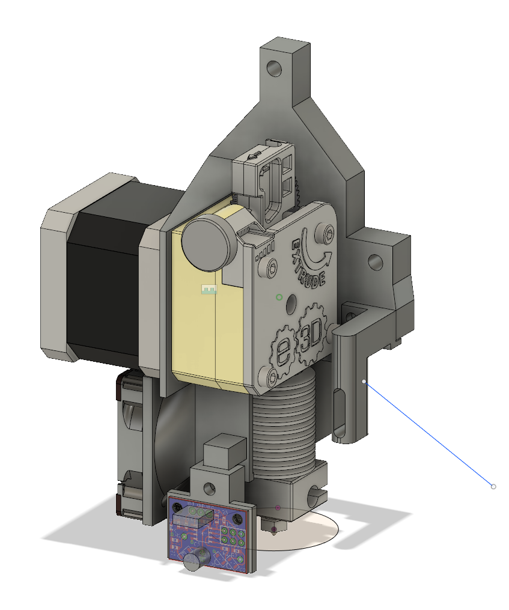

# Pegasus New Toolhead

This is a toolhead for the Pegasus which uses the E3D Titan, Noctua hot end
fan, David Crocker optical bed probe (I do not recommend this for use on
glass!) and a 40mm axial part cooling fan.

## Status
This project is in a middle stage. I have not printed and tested the version
here in master, however an earlier prototype is in service, albeit with not
that many production hours on it. The version in master fixes issues with
interferences of the M3 bolt head for the belt holder as well as an
interference when using thick part cooling fans.

That being said, I no longer have my Pegasus, so this will not be developed any
further.

I am not satisfied with the printability of this project or its ease of
assembly. Use this at your own risk.

## Required parts
- 40x10mm fan for hot end
- 40x10mm or 40x20mm part cooling fan
- 2x M3x10mm socket head cap screws
- 4x M3x25mm (if 20mm thick part fan) or M3x15mm screw
- 5x M3x15mm screw for hot end fan and part cooling fan mount
- 2x M3 nut

