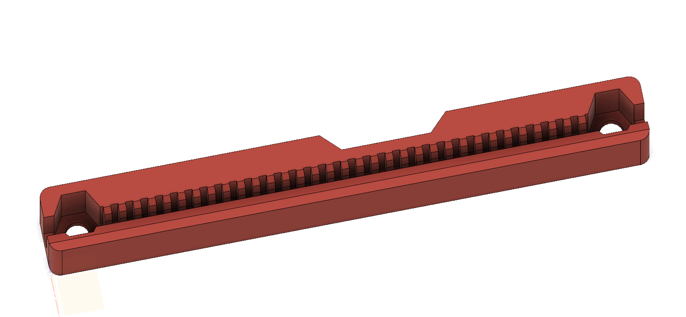
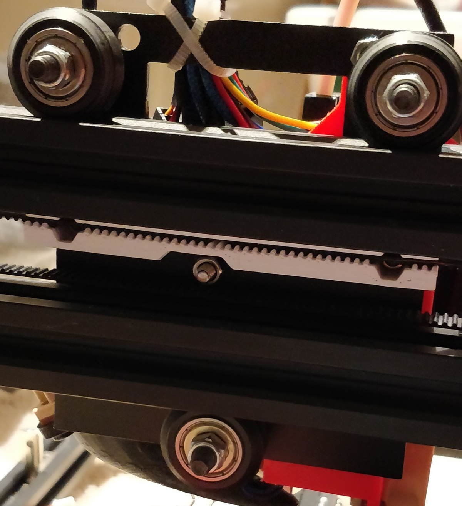

# Pegasus X belt holder

This is another modification of the Y belt holder from the Prusa i3 MK3 design,
this time to fix the X axis of the Pegasus. This eliminates the zip ties which
do not hold the belt against any appreciable tension.

Required hardware:
- 2x M3x7mm socket head cap screws (sorry! I made mine by cutting down 10mm ones,
  but 6mm should work, though with approximately 0.5mm of the nut's thread not
  engaged)
- 2x M3 hex nut

Images:

This is an image of an older prototype. Since then, I've shortened it slightly
to ensure it cannot cause any interferences with the end of the X axis, and
adjusted the tolerances of the M3 nuts so they don't fall out during assembly.
