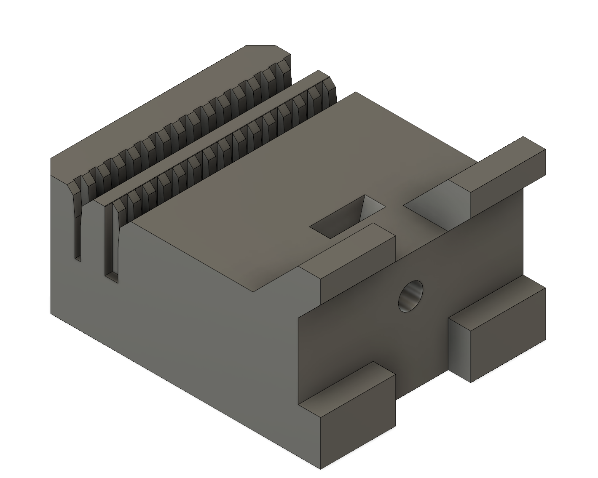

# Y belt holder for the MakerFarm Pegasus

This is a replacement holder for the Y belt on the Pegasus to eliminate the
old-school and hard to tension stock design which uses zip ties.

Because printers usually blow out corners, this part will require filing unless
printed on an exceptionally well tuned printer.

It is based on the Prusa i3 MK3 part, so the license for this specific part
is the GNU GPLv2. A copy of the license is available in the file LICENSE in
this directory.

## Required hardware

- 1x M3 nut
- 1x M3 bolt, 10-15mm length

