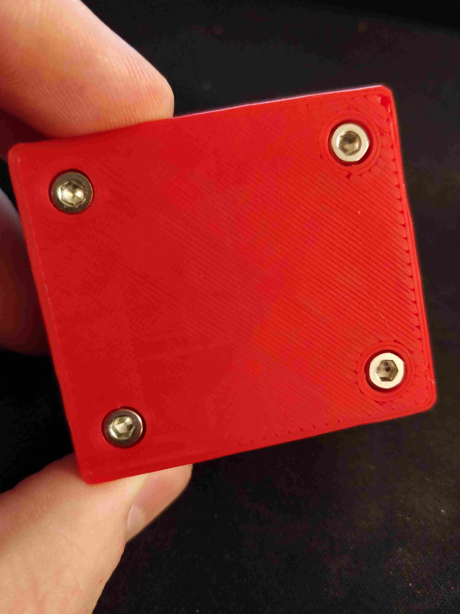

# Case for Cytron RC Relay

This is a case for the [Cytron RB-Cyt-167](https://www.robotshop.com/ca/en/cytron-10a-radio-controlled-relay-switch.html)
10A RC controlled relay. It uses 4 M3x10mm screws to retain the relay board and
prints in two parts.

## File formats
- Editable Fusion 360 f3d (original format)
- Semi-editable and portable STEP
- Printable STL